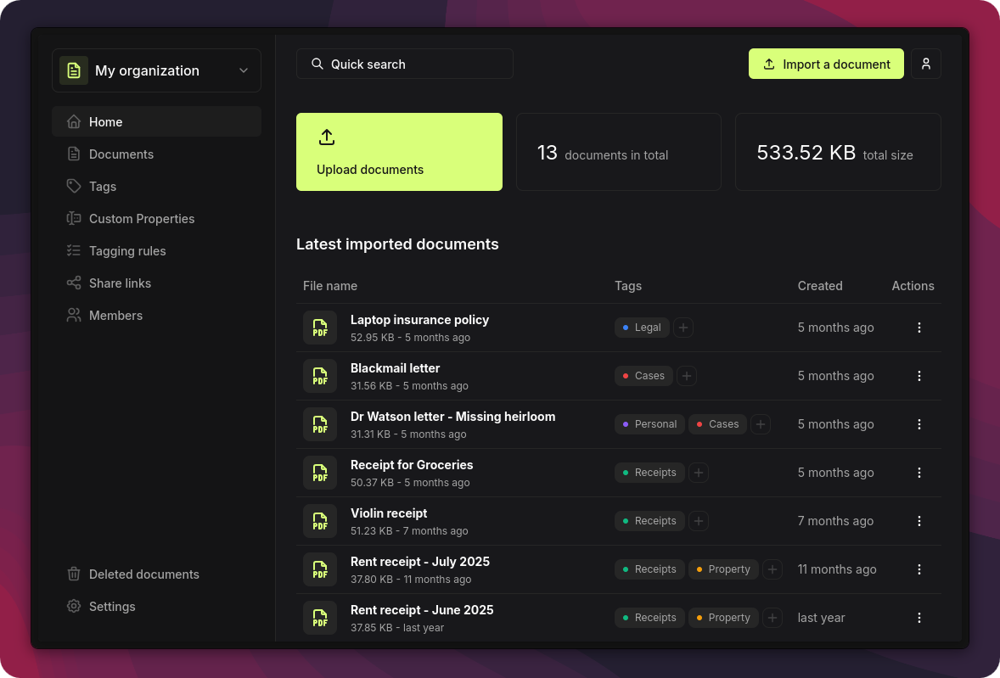

<p align="center">
<picture>
    <source srcset="./.github/icon-dark.png" media="(prefers-color-scheme: light)">
    <source srcset="./.github/icon-light.png" media="(prefers-color-scheme: dark)">
    
</picture>
</p>

<h1 align="center">
  Papra - Document management platform
</h1>
<p align="center">
  Minimalistic document management and archiving platform.
</p>

<p align="center">
  <a href="https://demo.papra.app">Demo</a>
  <span>&nbsp;&nbsp;•&nbsp;&nbsp;</span>
  <a href="https://docs.papra.app">Docs</a>
  <span>&nbsp;&nbsp;•&nbsp;&nbsp;</span>
  <a href="https://docs.papra.app/self-hosting/using-docker">Self-hosting</a>
  <span>&nbsp;&nbsp;•&nbsp;&nbsp;</span>
  <a href="https://github.com/orgs/papra-hq/projects/2">Roadmap</a>
  <span>&nbsp;&nbsp;•&nbsp;&nbsp;</span>
  <a href="https://papra.app/discord">Discord</a>
  <!-- <span>&nbsp;&nbsp;•&nbsp;&nbsp;</span>
  <a href="https://dashboard.papra.app">Managed instance</a> -->
</p>

## Introduction

**Papra** is a minimalistic document management and archiving platform. It is designed to be simple to use and accessible to everyone. Papra is a platform for long-term document storage and management, like a digital archive for your documents.

Forget about that receipt of that gift you bought for your friend last year, or that warranty for your new phone. With Papra, you can easily store, forget, and retrieve your documents whenever you need them.

A live demo of the platform is available at [demo.papra.app](https://demo.papra.app) (no backend, client-side local storage only).

[](https://demo.papra.app)

## Project Status

Papra is under active development, the core functionalities are stable and usable. With lots of features and improvements added regularly.

Feedback and bug reports are highly appreciated to help us improve the platform.

## Features

- **Document management**: Upload, store, and manage your documents in one place.
- **Organizations**: Create organizations to manage documents with family, friends, or colleagues.
- **Search**: Quickly search for documents with full-text search and advanced filters.
- **Authentication**: User accounts and authentication.
- **Dark Mode**: A dark theme for those late-night document management sessions.
- **Responsive Design**: Works on all devices, from desktops to mobile phones.
- **Open Source**: The project is open-source and free to use.
- **Self-hosting**: Host your own instance of Papra using Docker or other methods.
- **Tags**: Organize your documents with tags.
- **Email ingestion**: Send/forward emails to a generated address to automatically import documents.
- **Content extraction**: Automatically extract text from images or scanned documents for search.
- **Tagging Rules**: Automatically tag documents based on custom rules.
- **Folder ingestion**: Automatically import documents from a folder.
- **CLI**: Manage your documents from the command line.
- **API, SDK and webhooks**: Build your own applications on top of Papra.
- **i18n**: Support for multiple languages.
- **Custom properties**: Define per-organization custom properties to store additional information about documents.
- _Coming soon:_ **Document sharing**: Share documents with others.
- _Coming soon:_ **Document requests**: Generate upload links for people to add documents.
- _Coming maybe one day:_ **Mobile app**: Access and upload documents on the go.
- _Coming maybe one day:_ **Desktop app**: Access and upload documents from your computer.
- _Coming maybe one day:_ **Browser extension**: Upload documents from your browser.
- _Coming maybe one day:_ **AI**: Use AI to help you manage or tag your documents.

## Support

Papra is a free and open-source project, but it is not free to run and develop. If you want to support the project, you can become a sponsor on [GitHub Sponsors](https://github.com/sponsors/corentinth) or [Buy me a coffee](https://buymeacoffee.com/cthmsst).
If you are a company, you can also [contact me](https://papra.app/contact) to discuss a sponsorship.

## Self-hosting

Papra is dedicated to providing a simple yet highly configurable self-hosting experience. Our lightweight Docker image (<200MB) is compatible with multiple architectures including x86, ARM64, and ARMv7.

For a quick start, simply run the following command:

```bash
docker run -d --name papra -p 1221:1221 -e AUTH_SECRET=a-dummy-secret-for-testing-purposes-only ghcr.io/papra-hq/papra:latest
```

> The `AUTH_SECRET` above is fine for kicking the tires, but for any real instance you should generate your own with `openssl rand -hex 48` (or similar).

Please refer to the [self-hosting documentation](https://docs.papra.app/self-hosting/using-docker) for more information and configuration options.

### Self-hosting with Docker Compose

This repository ships with a ready-to-use [`docker-compose.yml`](./docker-compose.yml) plus a documented [`.env.example`](./.env.example) template. Configuration is loaded from a `.env.prod` file that you create locally and that is **not** committed to git.

#### 1. Prepare the environment file

Copy the example file and fill in your values:

```bash
cp .env.example .env.prod
```

At minimum, generate and set a secure `AUTH_SECRET`:

```bash
# Linux / macOS / Git Bash
openssl rand -hex 48
```

```powershell
# PowerShell
-join ((1..96) | ForEach-Object { '{0:x}' -f (Get-Random -Max 16) })
```

Open [`.env.prod`](./.env.prod) and paste the generated secret as the value of `AUTH_SECRET`. Adjust `APP_BASE_URL` and `PAPRA_HOST_PORT` if needed (e.g. when running behind a reverse proxy or on a different port).

#### 2. Start the stack

```bash
docker compose up -d
```

Papra will be available at the `APP_BASE_URL` you configured (defaults to <http://localhost:1221>). Persistent data (database + uploaded documents) is stored in `./papra-data` next to the compose file.

#### 3. Update Papra

```bash
docker compose pull
docker compose up -d
```

#### 4. Stop / remove

```bash
docker compose down            # stop and remove the container, keep data
docker compose down -v         # also remove anonymous volumes (data in ./papra-data is preserved on the host)
```

#### Available environment variables

| Variable           | Required | Default                  | Purpose                                                                           |
| ------------------ | -------- | ------------------------ | --------------------------------------------------------------------------------- |
| `AUTH_SECRET`      | yes      | –                        | Secret used to sign auth tokens. Generate with `openssl rand -hex 48`.            |
| `APP_BASE_URL`     | no       | `http://localhost:1221`  | Public base URL of the application (set this when using a reverse proxy/domain). |
| `PAPRA_HOST_PORT`  | no       | `1221`                   | Host port published by Docker. The container always listens on `1221` internally. |

Many more options (SMTP, OAuth providers, OCR languages, S3 storage, …) are described in [`.env.example`](./.env.example) and the [official configuration reference](https://docs.papra.app/self-hosting/configuration).

> **Note:** [`.env.prod`](./.env.prod) contains secrets and is git-ignored. Never commit it.

## Contributing

Contributions are welcome! Please refer to the [`CONTRIBUTING.md`](./CONTRIBUTING.md) file for guidelines on how to get started, report issues, and submit pull requests.
You can find easy-to-pick-up tasks with the [`good first issue`](https://github.com/papra-hq/papra/issues?q=sort%3Aupdated-desc%20is%3Aissue%20is%3Aopen%20label%3A%22good%20first%20issue%22) or [`PR welcome`](https://github.com/papra-hq/papra/issues?q=sort%3Aupdated-desc%20is%3Aissue%20is%3Aopen%20label%3A%22good%20first%20issue%22) labels.

## License

This project is licensed under the AGPL-3.0 License - see the [LICENSE](./LICENSE) file for details.

## Community

Join the community on [Papra's Discord server](https://papra.app/discord) to discuss the project, ask questions, or get help.

## Credits

This project is crafted with ❤️ by [Corentin Thomasset](https://corentin.tech).
If you find this project helpful, please consider [supporting my work](https://buymeacoffee.com/cthmsst).

## Acknowledgements

### Stack

Papra would not have been possible without the following open-source projects:

- **Frontend**
  - **[SolidJS](https://www.solidjs.com)**: A declarative JavaScript library for building user interfaces.
  - **[Shadcn Solid](https://shadcn-solid.com/)**: UI components library for SolidJS based on Shadcn designs.
  - **[UnoCSS](https://unocss.dev/)**: An instant on-demand atomic CSS engine.
  - **[Tabler Icons](https://tablericons.com/)**: A set of open-source icons.
  - And other dependencies listed in the **[client package.json](./apps/papra-client/package.json)**
- **Backend**
  - **[HonoJS](https://hono.dev/)**: A small, fast, and lightweight web framework for building APIs.
  - **[Drizzle](https://orm.drizzle.team/)**: A simple and lightweight ORM for Node.js.
  - **[Better Auth](https://better-auth.com/)**: A simple and lightweight authentication library for Node.js.
  - **[CadenceMQ](https://github.com/papra-hq/cadence-mq)**: A self-hosted-friendly job queue for Node.js, made by Papra.
  - And other dependencies listed in the **[server package.json](./apps/papra-server/package.json)**
- **Documentation**
  - **[Astro](https://astro.build)**: A great static site generator.
  - **[Starlight](https://starlight.astro.build)**: A module for Astro that provides a starting point for building documentation websites.
  - **[HiDeoo/starlight-theme-rapide](https://github.com/HiDeoo/starlight-theme-rapide)**: A theme for Starlight.
- **Project**
  - **[PNPM Workspaces](https://pnpm.io/workspaces)**: A monorepo management tool.
  - **[Github Actions](https://github.com/features/actions)**: For CI/CD.
- **Infrastructure**
  - **[Cloudflare Pages](https://pages.cloudflare.com/)**: For static site hosting.
  - **[Fly.io](https://fly.io/)**: For backend hosting.
  - **[Turso](https://turso.tech/)**: For production database.

### Inspiration

This project would not have been possible without the inspiration and work of others. Here are some projects that inspired me:

- **[Paperless-ngx](https://paperless-ngx.com/)**: A full-featured document management system.

## Sponsors

Shout-out to our current sponsors:

