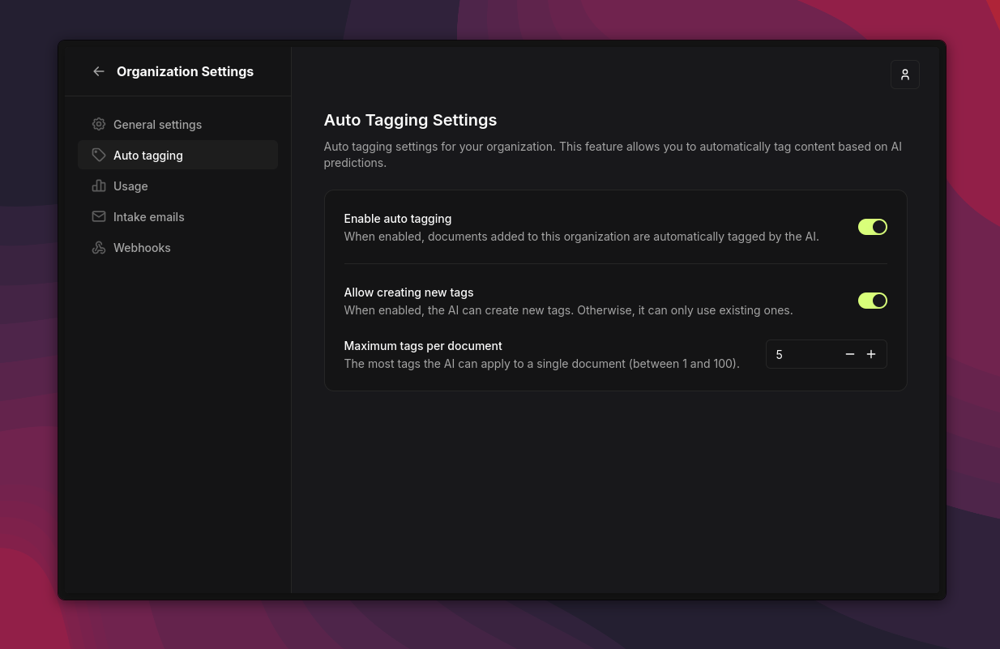

This guide shows you how to set up AI-powered auto tagging for your documents.

## What is auto tagging?

Once a document's content has been extracted, Papra can automatically apply the most relevant tags based on that content. This is done using an LLM, which analyzes the text and suggests appropriate tags from your existing tags and their descriptions. You can also let it create new tags when none of the existing ones are relevant.

The configuration lives per-organization, so each organization can independently:
- Enable or disable auto tagging
- Choose whether to create new tags
- Limit the number of tags applied to each document

## Prerequisites

Auto tagging relies on two things:

1. **A configured LLM provider.** Papra supports many providers out of the box, plus any OpenAI-compatible API. See the [LLM configuration guide](/guides/llm-configuration) for details.
2. **Content extraction.** Tags are derived from the document's extracted text, so the document must go through [content extraction](/guides/content-extraction) first.

## Enabling auto tagging (server)

Auto tagging is gated by two server-side switches: the global AI switch and the auto tagging switch. Both must be enabled (the auto tagging switch is enabled by default).

Example configuration using a local Ollama instance:

```bash
AI_IS_ENABLED=true
AI_DEFAULT_MODEL=ollama://qwen3:8b
AUTO_TAGGING_ENABLED=true
```

### Server options

| Variable | Default | Description |
| --- | --- | --- |
| `AI_IS_ENABLED` | `false` | Master switch for all AI features. Must be `true`. |
| `AUTO_TAGGING_ENABLED` | `true` | Whether organizations are allowed to use auto tagging. |
| `AUTO_TAGGING_MODEL` | falls back to `AI_DEFAULT_MODEL` | The model used for auto tagging, in `<adapter>://<model>` form. |
| `AUTO_TAGGING_DEFAULT_MAX_TAGS` | `5` | Default maximum number of tags per document. Can be overridden per organization. |

Once enabled on the server, organizations can turn auto tagging on in their settings.

## Configuring auto tagging (organization)

In your organization settings, under the **Auto tagging** section, you can configure:

- **Enable auto tagging**: Enable or disable auto tagging for this organization.
- **Create new tags**: Allow or disallow creating new tags when none of the existing tags are relevant.
- **Max number of tags**: Limit how many tags can be applied to each document (default `5`). The LLM may return fewer.



Once enabled, every time a document is added to Papra its extracted content is sent to the LLM for analysis, and the most relevant tags are applied automatically.

:::tip
Tag descriptions matter. The LLM uses each tag's name **and** description to decide what is relevant, so adding clear descriptions to your tags significantly improves the quality of the suggestions.
:::

## Troubleshooting

If auto tagging is not working as expected:

- Check the server logs for errors related to the LLM provider or the auto tagging process.
- Ensure the LLM provider is correctly configured and reachable from the Papra server (see [LLM configuration](/guides/llm-configuration)).
- Confirm both `AI_IS_ENABLED` and `AUTO_TAGGING_ENABLED` are set, and that auto tagging is enabled in the organization settings.
- Make sure the document's content was extracted — with no extracted text, the LLM has nothing to tag.
- If no new tags ever appear, check that **Create new tags** is enabled and that the max tags limit is not too low.
